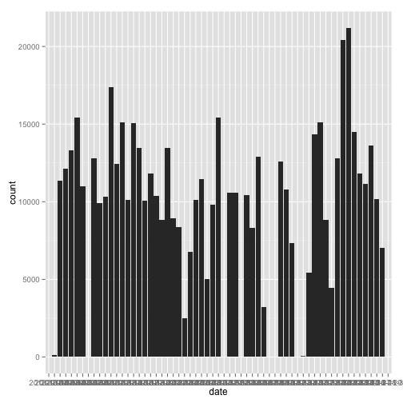

##Loading and preprocessing the data


```r
#import required libraries
library(plyr)
library(ggplot2)
library(lattice) 

#import data
act <- read.csv(unzip('activity.zip','activity.csv'))

act$hour <- floor(act$interval/100)
act$minute <- act$interval - 100*act$hour

#create time field from above(fixing date)
act$time <- ISOdatetime(0, 1, 1, act$hour, act$minute, 0, tz = "")

act <- act[,c(1,2,6)]
```

Interval changed from text 'hhmm' format to time field.


##What is mean total number of steps taken per day?

1.

```r
step.total <- sum(act$steps,na.rm=TRUE)
```
The total number of steps is 570608

2.

```r
#summarise steps by date, use NA if no data available for that day
date.sum <- ddply(act,.(date),summarize,sum=sum(steps,na.rm=FALSE))

#create histogram (fix axis)
qplot(date,data=date.sum,weight=sum,geom="histogram")
```

 

3.

```r
#mean and median (as vector), ignoring NA values
Date.mean <- as.integer(round(mean(date.sum$sum,na.rm=TRUE),0))
Date.median <- median(date.sum$sum,na.rm=TRUE)
```

The mean is 10766 & the median is 10765. (had to force mean to integer, was showing in weird sci format even with rounding)

##What is the average daily activity pattern?

1.


```r
#summarise by time
time.sum <- ddply(act,.(time),summarize,mean=mean(steps,na.rm=TRUE))

#create plot
plot(time.sum$time,time.sum$mean,type="l",xlab="Time of Day",ylab="Mean Step Count")
```

 

2.

```r
max.int <- format(time.sum[(time.sum$mean == max(time.sum$mean)),1],"%H:%M")
```

The time interval with the greatest average number of steps is 08:35

##Imputing missing values

1.


```r
x <- is.na(act$steps)
```

Total number of missing values in the dataset is 2304.

2.

Strategy is to use mean number of steps for the time interval.

3.


```r
#merge act dataset with int.mean
act.est <- merge(act,time.sum)

#if steps is na replace with mean (rounded to nearest step)
act.est$steps <- ifelse(is.na(act.est$steps),round(act.est$mean,0),act.est$steps)

#first 3 columns only
act.est <- act.est[,1:3]
```

4.


```r
est.sum <- ddply(act.est,.(date),summarize,sum=sum(steps,na.rm=FALSE))

#create histogram (fix axis)
qplot(date,data=est.sum,weight=sum,geom="histogram")
```

 

```r
#mean and median (as vector), ignoring NA values
Est.mean <- as.integer(round(mean(est.sum$sum,na.rm=TRUE),0))
Est.median <- as.integer(median(est.sum$sum,na.rm=TRUE))
```

With estimations for missing values the mean is 10766 & the median is 10762.  

The impact of adding in the missing values is minimal because they were being excluded from the original mean/median calculations and the spread of NA values was across the day.

##Are there differences in activity patterns between weekdays and weekends?

1.


```r
act.est$weekday <- weekdays(as.Date(act.est$date,format="%Y-%m-%d"),abbreviate = TRUE)
act.est$weekday <-  factor(act.est$weekday %in% c("Mon","Tue","Wed","Thu","Fri")+1L,
      levels=1:2, labels=c('weekend', 'weekday'))
```
2.


```r
weekday.sum <- ddply(act.est,.(time,weekday),summarize,mean=mean(steps,na.rm=TRUE))


xyplot(mean ~ time | weekday, data = weekday.sum,type = "l",layout=c(1,2))
```

 
